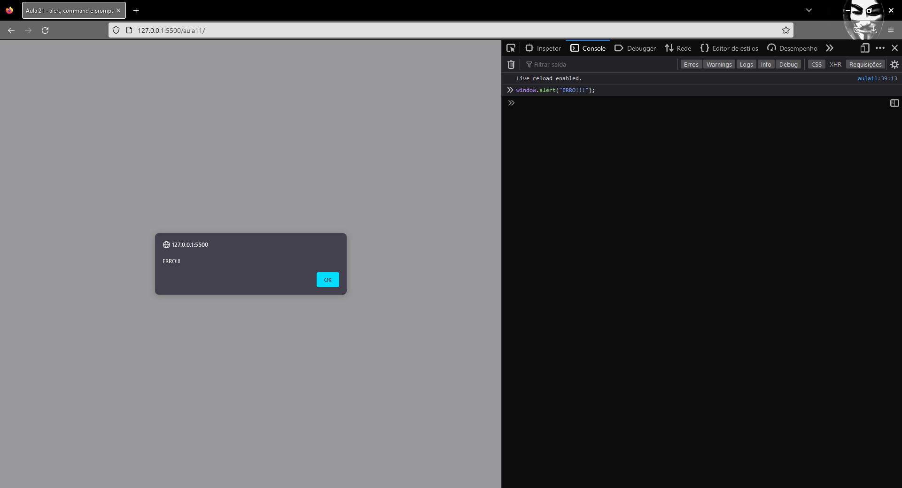
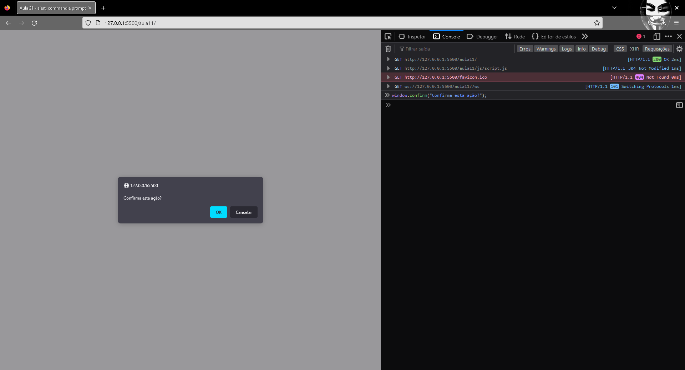
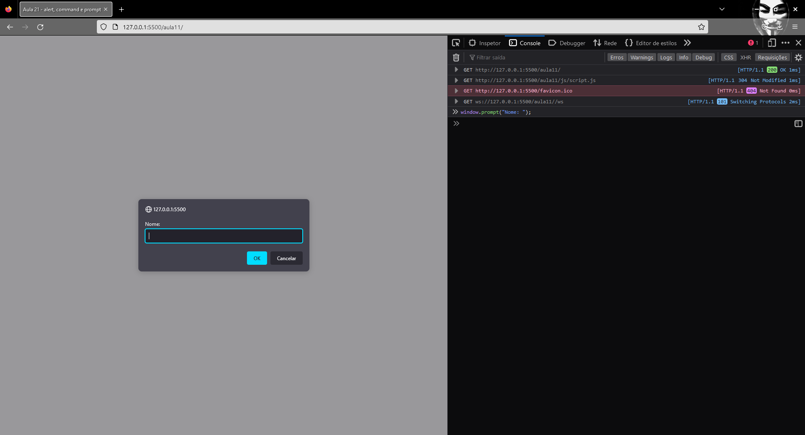

# Curso de JavaScript and TypeScript do básico ao avançado 2022

**Referência:** https://www.udemy.com/course/curso-de-javascript-moderno-do-basico-ao-avancado/

---

## Seção 2: JavaScript básico - para iniciantes

### Aula 13: variáveis com `let`

- Não podemos criar variáveis com palavras **reservadas**;
- Variáveis precisam ter nomes significativos;
- Não pode começar o nome de uma variável com um número;
- Não podem conter espaços ou traços;
- utilizamos `camelCase`;
- case sensitive;
- Não é possível **redeclarar** variáveis com `let`;


### Aula 14: constantes com `const`

Uma constante é uma palavra que não pode ser modificada, como uma variável pode. Por exemplo, `const pi = 3.141592`. Suponhamos:

```javascript
const pi = 3.141592;
console.log(pi);
```
> 3.141592


```javascript
pi = 5.12;
console.log(pi);
```
> TypeError: Assignment to constant variable.

É permitido atribuir a uma constante (ou variável) o valor de outra constante (ou variável).

Ver o tipo de variável:

```javascript
typeof(pi);
```
> number

### Aula 16: Exercícios - Const e Let

Considere o código abaixo:
```javascript
console.log(nome + " " + sobrenome + " tem " + idade + " anos, pesa " + peso + "kg\n");
console.log("tem " + altura + " de altura e seu IMC é de " + imc + "\n");
console.log(nome + " nasceu em " + anoNascimento);
```

Ele significa a mesma coisa que o seguinte:
```javascript
console.log(`${nome} está testando template string, ela possui ${idade} anos.`);
```

O recurso de colocar uma variável dentro da String através de crases e ${nome_variável} se chama **template strings**.

### Aula 18: Let vs Var - Primeira diferença

- Primeira diferença: `var` pode ser redeclarado, ao contrário de `let`.

É possível declarar variáveis das seguintes formas:
- `let variavel;`
- `var variavel;`
- `const constante;`
- `variavel;`

Porém, **não se recomenda usar a segunda e quarta forma**.

### Aula 19: Tipos de dados primitivos

Em JavaScript puro não utilizamos tipagem de dados. Java, por exemplo, colocamos: 
```java
String nomeAluno = "Beatriz";
double pi = 3.14;
```

Em Javascript é simplesmente:
```javascript
const nomeAluno = "Beatriz";    // string
const numPi = 3.1415;       // number
const aprovado = false      // booleano
```

Outro detalhe também é que apesar de existirem diversos domínios no conjunto numérico, não explicitamos se é um **inteiro**, **real**, **racional**, etc.

Outro ponto a se observar também é a **difrença entre `null` e `undefined`**. Considere a variável abaixo:
```javascript
let nomeAluno;
let emailAluno = null;
```

O primeiro será settado por *default* o valor de **undefined**. Enquanto o segundo é explicitado como **null**. Em ambos os casos, **não existe referência para a memória**.

*Obs.: só é possível criar uma variável sem inicializá-la se esta for `let`.*

Existe uma diferença entre tipos de dados primitivos e tipos de dados passados por referência. Quando se é por referência, o segundo objeto passa a ser uma cópia do outro. Veja os códigos abaixo.

```javascript
const a = [1, 2];
const b = a;
console.log(a, b);
```
> [1, 2] [1, 2]

```javascript
b.push(4);
console.log(a, b);
```

O resultado **adequado** seria:
> [1, 2] [1, 2, 4]

Porém, o que, de fato, resulta é:
> [1, 2, 4] [1, 2, 4]

Isso se deve ao fato de apontarem para a **mesma posição da memória**.

### Aula 21: Alert, confirm e prompt (Navegador)

O `alert` dispara uma mensagem de alerta no navegador:



**Sintaxe:**
```javascript
window.alert("Você está sujeito aos termos e condições");
```

Já o `confirm` exibe uma mensagem de confirmação no navegador.



**Sintaxe:**
```javascript
window.confirm("Clique 'ok' para prosseguir");
```

O `prompt` permite um texto de entrada.



**Sintaxe:**
```javascript
window.prompt("Usuário: ");
```

Todas três instruções acima são chamadas de **funções** e o que é passado a elas entre parênteses são os **argumentos**. Na realidade, como o `alert`, `confirm` e `prompt` estão dentro de `window`, dizemos que este último é a função e os três acima são os **métodos**.

A função `confirm` retorna um valor **booleano**.

Fazendo o código abaixo:
```javascript
let num1 = prompt('digite um número: ');
let num2 = prompt('digite outro numero: ');

num1+num2;

let saida = num1+num2;
saida
```
> digite um número: 2
> digite outro numero: 10
> 210

Ao invés de executar a operação de adição, ele concatena as strings. Isto ocorre, pois todos os dados de entrada vêm como string.

Para corrigir o equívoco acima, devemos declarar fazendo um `parser`.

```javascript
num1 = parseFloat(num1);
num2 = parseFloat(num2);
let saidaFloat = num1+num2;

saidaFloat
```
> 12
### Aula 24: mais sobre strings

Como escapar string?

```javascript
let doisString = "Um \"texto\"";        // escapando string

console.log(doisString);

// Inserir uma barra invertida no texto
let tresString = "Um \\texto";
console.log(tresString);
```

> Um "texto"
>
> Um \texto

Função `slice`:

```javascript
let caminhoDeOutroArquivo = "C:\\\Users\\\beatr\\\Documents\\\input.csv";
console.log(caminhoDeOutroArquivo.slice(caminhoDeOutroArquivo.length - 3, caminhoDeOutroArquivo.length));
```

> csv

Função `charAt()`:

```javascript
let caminhoDoArquivo = "C:\\\Users\\\beatr\\\Documents\\\input.csv";
console.log(caminhoDoArquivo.charAt(caminhoDoArquivo.length-3));
```

> c

Função `concat`:

Faz a mesma coisa que concatenar strings com `+`:

```javascript
let poesia = "Há uma pedra no meio do caminho";
let continuaPoesia = "No meio do caminho há uma pedra";
console.log(poesia + "\n" + continuaPoesia);
console.log("Usando concat: \n\n" + poesia.concat("\n" + continuaPoesia));
```

### Aula 29: arrays

Um array é uma coleção de dados. Exemplo: `const meuArray = ["nome1", "nome2", "nome3", 3, ["fundamental", "médio", "superior"], true, null]`.
No exemplo acima é possível perceber que existem diferentes tipos de dados dentro de um array. Isso quer dizer que é **heterogêneo**. Apesar de não ser considerado
uma boa prática de programação.

Arrays tambem são indexados, mas são por elementos. Considerando o array `const nomes = ['bea', 'joao', 'luis']`, o `nomes[0] = bea; nomes[1] = joao`.

Eu fiz um teste para ver a exibição de elementos de array, usando `forEach` e o `for` usual. A conclusão é que o primeiro **não** exibe o **índice**, apenas elemento ao contrário do segundo.

```javascript
alunos.forEach( (elemento) => console.log(`Elemento cujo índice é ${elemento}: ${alunos[elemento]}`));
```
> Elemento cujo índice é Luiz: undefined index.js:8:39
> 
> Elemento cujo índice é Maria: undefined index.js:8:39
> 
> Elemento cujo índice é João: undefined index.js:8:39

```javascript
for(i=0; i<alunos.length; i++) {
    console.log(`Elemento cujo índice é ${i}: ${alunos[i]}`);
}
```
> Elemento cujo índice é 0: Luiz index.js:12:13
> 
> Elemento cujo índice é 1: Maria index.js:12:13
>
> Elemento cujo índice é 2: João index.js:12:13


Para inserir elementos dentro de um array basta `alunos[3] = "bea gomes";`. O `3` se refere à quarta posição (0, 1, 2, 3) do array. Se não soubermos o tamanho total
do array podemos fazer da seguinte forma: `alunos[alunos.length] = "ana";`.

Outra forma é utilizar a função `push`. Esta adiciona um elemento no final do array sem precisar saber a posição.
```javascript
alunos.push('Otávio');
```

O método `unshift` adiciona um elemento no índice 0 do array.

Podemos **remover** elementos dentro do array também. Através do método `pop()`, podemos remover do **fim** do array.
```javascript
const alunoRemovido = alunos.pop();
```

A constante `alunoRemovido` terá como valor o elemento removido, que era o **último** elemento do array.

Quando usamos a expressão `delete alunos[1]`, ele remove o elemento da posição 1 e deixa aquele espaço como `undefined`. Caso peça para imprimir o array, é colocado naquele espaço `<1 empty slot>`.

Quando digitamos `console.log(typeof alunos);`, esperamos que ele retorne a informação que `alunos` é um `array`, porém **tudo** no javascript são **Objects**, **objetos**. Portanto, o retorno do console log acima é `Object`.
Se quisessemos confirmar que `alunos` é um `array`, faríamos: `console.log(alunos istanceof Array);`.

### Aula 31. Funções (Básico)

Sintaxe para criar funções:

```javascript
function nomeDaFuncao(argumento1, argumento2) {
    // ...
}
```

Na lógica da função acima, não é necessário colocar `;`.

Para executar a função, basta chamá-la:

```javascript
nomeDaFuncao(argumento1, argumento2);
```

Uma função **pode** retornar valores.


### Conteúdo extra

Segundo [Mozilla MDN](https://developer.mozilla.org/pt-BR/docs/Learn/Getting_started_with_the_web/JavaScript_basics#:~:text=JavaScript%20%C3%A9%20a%20linguagem%20de,%2C%20estilo%20din%C3%A2mico%2C%20anima%C3%A7%C3%B5es), existem cerca de 5 tipos de dados diferentes no Javascript. São eles:

- String: uma sequência de caracteres. `let minhaVariavel = 'Bob';`

- Number: números inteiros e reais. `let minhaVariavel = 10;`

- Boolean: valor lógico, em que pode ser true ou false. `let minhaVariavel = true;`

- Array: uma estrutura que permite armazenar vários valores em uma única variável. 
```javascript
let meuArray = ['Bob', 1, 4.10, 'Josh'];

console.log(meuArray[0]);
```

A saída do `console.log(meuArray[0])` é:
> Bob


- Object: tudo em javascript é um **objeto** e pode ser armazenado em uma variável. Todos os exemplos acima são Objects também. `let minhaVariavel = document.querySelector('h1');`


Com relação aos operadores matemáticos, eles seguem o padrão de * para multiplicação, + para adição, - para subtração e / para divisão. O adendo é relacionado aos operadores relacionais, onde teremos algumas diferenças do padrão.

- **Atribuição:** `=`

- **Operador de igualdade:** `===`

- **Negação, não igual:** `!`, `!==`

#### Condicionais

Uma estrutura condicional é da seguinte forma:

```javascript
let doceFavorito = "Chocolate";

if (doceFavorito === "chocolate") {
    alert("Opa, eu amo chocolate também!");
} else {
    alert("O meu doce favorito é açaí!");
}
```

#### Funções

Funções são uma forma de encapsular funcionalidades de maneira que possamos reutilizar posteriormente. A expressão abaixo é uma função:
```javascript
let minhaVariavel = document.querySelector("h1");
```

```javascript
function multiplica(num1, num2) {
    return num1*num2;
}

// chamado a funcao multiplica
multiplica(2, 2);
multiplica(1000, 0.10);
```

#### Eventos

Os eventos são uma forma de interagir em um site, são estruturas que percebem elementos no navegador. Por exemplo, quando você quer exibir um modal toda vez que passar por um botão ou apertar um botão. Esses procedimentos se chamam **eventos**. Vejamos um exemplo:

```javascript
document.querySelector('html').onclick = function() {
    alert('Ai! Para de me cutucar!');
}
```
